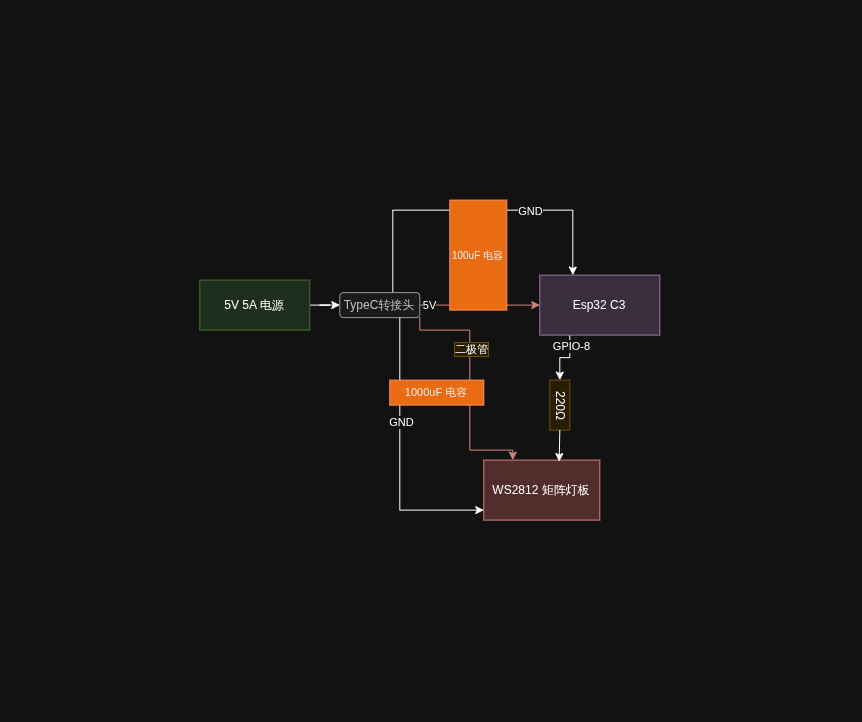

# 光域（Light Field）

<div align="center">

[]()
[]()
[]()
[]()
[]()
[]()

</div>

一个基于 **ESP32-C3** 与 **16×16 WS2812 矩阵灯板** 的嵌入式灯光控制系统。

目前已完成基础硬件搭建和 FastLED 驱动测试，能够通过代码控制矩阵显示指定颜色和图案。未来将逐步实现云端远程控制、前端画板交互等功能，打造一套完整的智能灯光控制方案。

## 硬件清单

| 组件 | 数量 | 说明 |
| --- | --- | --- |
| ESP32-C3 SuperMini 开发板 | 1 | 主控 |
| 16×16 WS2812 矩阵灯板 | 1 | 256 颗灯珠显示面板 |
| 400 孔面包板 | 1 | 电路搭建 |
| Micro USB 电源模块 | 1 | 5V 输入供电 |
| 1000µF 电解电容 | 1 | 灯板电源滤波 |
| 100µF 电解电容 | 1 | 开发板电源滤波 |
| 470Ω 电阻 | 1 | 信号线保护 |
| 1N4007 二极管 | 1 | 灯板防反接保护 |
| 杜邦线 | 若干 | 电路连接 |
| 5V 3A 电源适配器 | 1 | 外部供电 |

## 接线说明

- **电源**：使用 5V 3A 电源适配器供电，接线分两路：
  - 经 Micro USB 电源模块为开发板供电，并并接 100µF 电解电容滤波；
  - 一路直接为灯板供电，并接 1000µF 电解电容滤波，同时串联 1N4007 二极管防止接反损坏灯板。
- **信号**：ESP32-C3 的 **GPIO8** 作为灯板数据输入引脚，信号线上串联 470Ω 电阻做保护。



## 软件环境

- **系统**：Linux
- **IDE**：VS Code + Arduino 扩展
- **依赖库**：FastLED
- **开发板支持包**：MakerGO ESP32 C3 SuperMini（`esp32:esp32:makergo_c3_supermini`）

## 已完成功能

- [x] 硬件电路搭建与供电系统调试
- [x] FastLED 库驱动 WS2812 矩阵
- [x] 基础灯光测试（点亮指定数量灯珠、颜色控制）

若使用 VS Code + Arduino 扩展，选择 `光域.ino` 作为工程文件，开发板选择 `MakerGO ESP32 C3 SuperMini`，编译上传即可。

## 未来规划

- [ ] 增加云端控制后端（Cloudflare Workers）
- [ ] 开发前端画板网页，通过 API 发送像素数据
- [ ] 使用 ESP8266 / ESP32-C3 获取云端数据，通过 ESP-NOW 转发给灯板
- [ ] 实现远程实时控制矩阵显示

## 项目结构

```
光域/
├── README.md       # 项目说明
├── 光域.ino         # 主程序（FastLED 驱动）
├── 电路图.png        # 硬件接线图
└── .vscode/         # VS Code 配置
```

## 版本控制

项目使用 Git 进行版本管理，开发路径：`/home/tux/编程/嵌入式/光域/`。